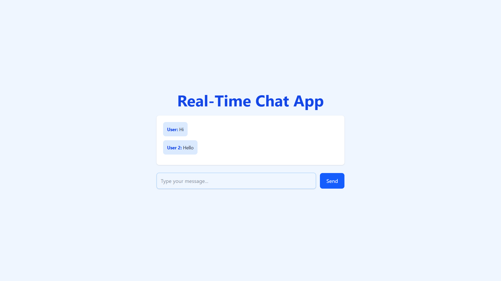

# Chatterbox 💬

A premium, real-time chat application built for modern web experiences. This project demonstrates a full-stack implementation of real-time communication using Socket.io, React, and MongoDB.



## 🚀 Key Features

- **Real-Time Messaging**: Instant message delivery using WebSockets.
- **Persistent History**: Chat history is saved to MongoDB and loaded on entry.
- **Live User Tracking**: See who's currently online with a dedicated sidebar.
- **Typing Indicators**: Visual feedback when someone is typing.
- **Premium UI/UX**:
  - Glassmorphism design system.
  - Smooth animations with Framer Motion.
  - Responsive layout (Mobile-friendly).
  - Modern typography and color palette.
- **System Notifications**: Automated alerts for user join/leave events.

## 🛠️ Tech Stack

- **Frontend**: React 19, Vite, Tailwind CSS 4, Framer Motion, Lucide Icons.
- **Backend**: Node.js, Express, Socket.io.
- **Database**: MongoDB (Mongoose ODM).
- **Tooling**: ESLint, Dotenv, Nodemon.

## 📦 Installation & Setup

### Prerequisites
- Node.js (v18+)
- MongoDB (Running locally or Atlas)

### 1. Clone the repository
```bash
git clone https://github.com/Guna02826/chatterbox.git
cd chatterbox
```

### 2. Backend Setup
```bash
cd backend
npm install
```
Create a `.env` file in the `backend` folder:
```env
PORT=5000
MONGO_URI=mongodb://localhost:27017/chatterbox
CLIENT_URL=http://localhost:5173
```
Start the server:
```bash
npm start
```

### 3. Frontend Setup
```bash
cd ../frontend
npm install
```
Create a `.env` file in the `frontend` folder:
```env
VITE_SOCKET_URL=http://localhost:5000
VITE_API_URL=http://localhost:5000/api
```
Start the development server:
```bash
npm run dev
```

## 📐 Architecture

Chatterbox follows a decoupled architecture where the frontend and backend communicate via a combination of RESTful APIs (for history) and WebSockets (for real-time events).

- **Backend**: Manages socket connections, broadcasts events, and handles persistence logic.
- **Frontend**: A modular React application using functional components and hooks for state management and side effects.

---
Built with ❤️ by [Guna](https://github.com/Guna02826)
